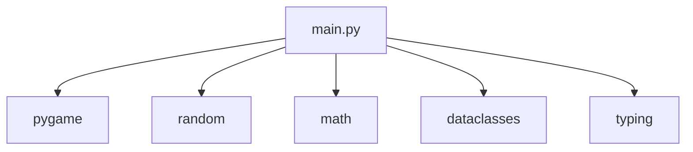
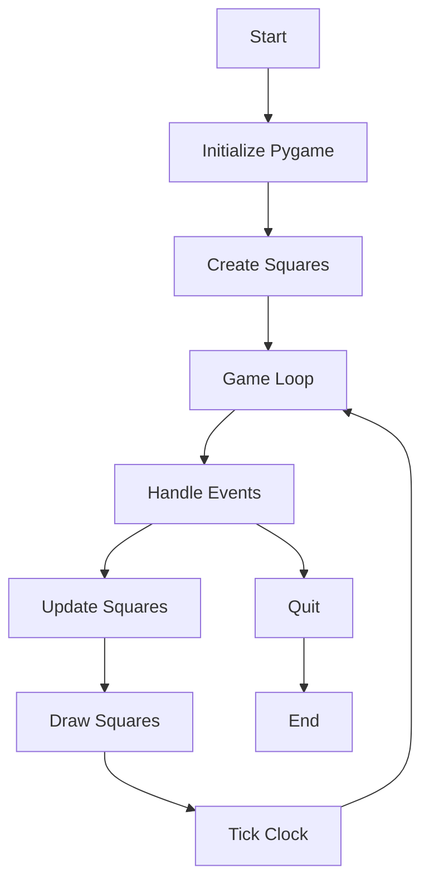
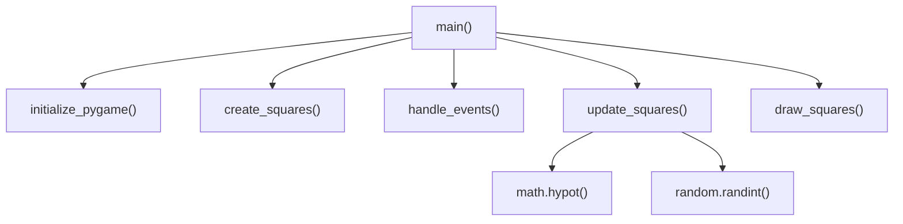

# Architecture Documentation

This document provides an overview of the architecture of the Moving Squares Pygame application.

## Dependency Graph of Modules

The application consists of a single Python file `main.py` that depends on several external libraries and standard modules.



## High-Level System/Runtime Flow Graph

The application follows a standard game loop structure: initialization, main loop with event handling, updates, and rendering, followed by cleanup.



## Function-Level Call Graph

The main function orchestrates the application by calling initialization and loop functions. Update and draw functions handle the core logic.



## Full Sequence Diagram for Primary Execution Path

The sequence diagram shows the flow from startup through the game loop until termination.

```mermaid
sequenceDiagram
    participant M as "Main"
    participant P as "Pygame"
    participant S as "Squares"

    M->>P: initialize_pygame()
    M->>S: create_squares()
    loop Game Loop
        M->>M: handle_events()
        alt Quit Event
            M->>P: pygame.quit()
        else Continue
            M->>S: update_squares()
            M->>P: draw_squares()
            M->>P: clock.tick()
        end
    end
```</content>
<parameter name="filePath">/Users/saintangegirija/Documents/lab8-pygame/docs/architecture.md